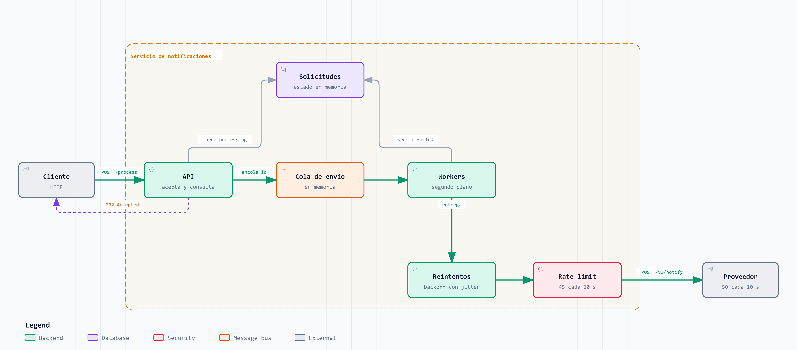
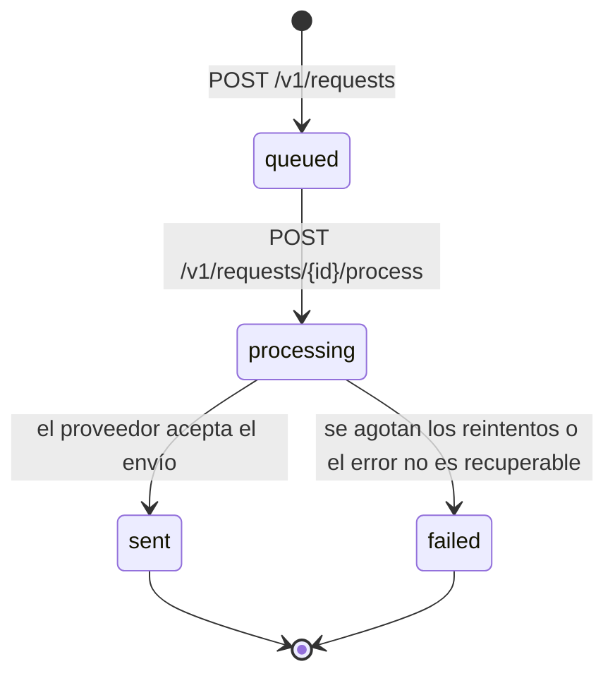

# AMS Solutions - Prueba técnica backend Python

Servicio de notificaciones que hace de mediador entre los clientes y un proveedor externo. El enunciado está en [docs/prueba-tecnica.md](docs/prueba-tecnica.md).

## Versiones

- La solución para la prueba técnica ha sido desarrollada en la carpeta `app` con la versión 3.12 de Python.

## Cómo ejecutarlo

Es necesario tener instalado Docker.

Levantar el proveedor y la infraestructura de evaluación:

```bash
docker-compose up -d provider influxdb grafana
```

Levantar la aplicación:

```bash
docker-compose up -d --build app
```

Ejecutar el test de carga:

```bash
docker-compose run --rm load-test
```

Los resultados se ven en [Grafana](http://localhost:3000/d/backend-performance-scorecard/).

**NOTA:** Para agilizar el desarrollo y no tener que hacer rebuild de la aplicación constantemente he usado un entorno virtual de Python para tener levantado el servicio de uvicorn constantemente y aprovechar el hot reloading. El resto de servicios se manejan de la misma forma con Docker, pero el app lo lanzo en modo desarrollo así:

```bash
cd app
py -3.12 -m venv .venv
source .venv/Scripts/activate
pip install -r requirements.txt # o requirements-dev.txt para modo desarrollo
uvicorn main:app --reload --port 5001
```

El puerto 5001 evita chocar con el 5000, que publica el contenedor del proveedor para la aplicación dockerizada y que es el que usa el test de carga.

### Tests

Desde `app/`, con el entorno virtual podemos lanzar los tests con el comando `pytest` (siempre y cuando tengamos instalada la dependencia).

Los tests viven en `app/tests/`, junto al código que prueban, para que la solución quede entera dentro de `app/`. `app/.dockerignore` excluye de la imagen de Docker `tests/`, `pytest.ini`, `requirements-dev.txt` y el entorno virtual `.venv/`.

- `tests/conftest.py` es común a todas las subcarpetas.
- `tests/unit/` prueba cada pieza aislada. No necesita el proveedor levantado: sus respuestas se simulan con `httpx.MockTransport`.
- `tests/integration/` prueba los endpoints de punta a punta dentro de la app: llama a la app en memoria con `httpx.ASGITransport`, sin levantar un servidor, y sustituye la dependencia del servicio con `app.dependency_overrides` para que cada test parta de un repositorio vacío.

Cada carpeta de tests lleva un `__init__.py` vacío para que pytest las importe como paquetes y se puedan repetir nombres de fichero entre `unit/` y otras subcarpetas.

### Integración continua

`.github/workflows/ci.yml` se ejecuta en cada pull request y en cada push a `main`. Lanza `pytest` con Python 3.12 y comprueba que la imagen de `app/` se construye. El test de carga con k6 no forma parte de la pipeline: necesita el proveedor, InfluxDB y Grafana levantados, y en los runners de GitHub los tiempos varían demasiado para que el resultado sea fiable. Se ejecuta en local con `docker-compose run --rm load-test`.

## Decisiones de diseño

### Cómo he abordado el problema

No había implementado antes un sistema con reintentos ni con rate limiting, y mi experiencia con Python y FastAPI es limitada en sistemas de alta criticidad, así que antes de escribir código quise entender bien qué se me estaba pidiendo. Leí el enunciado, el Swagger y el código del proveedor, y saqué dos números que acabaron mandando sobre todo el diseño:

- El test de carga sube hasta 200 usuarios virtuales que crean y procesan solicitudes sin parar, lo que supone del orden de un centenar de solicitudes por segundo.
- El proveedor solo acepta 50 llamadas cada 10 segundos, unas 5 por segundo, tarda entre 0,1 y 0,5 segundos en responder y falla al azar en un 10% de las llamadas.

La conclusión fue que es imposible enviarlo todo mientras dura la prueba, y que no tenía sentido intentarlo. Lo que sí podía controlar era que mi API respondiera rápido y sin errores pasara lo que pasara con el proveedor, que no se perdiera ninguna notificación por un fallo pasajero y que no se enviara ninguna dos veces. A partir de ahí ordené el trabajo por impacto, en hitos pequeños con su propio pull request:

1. Desacoplar el envío de la petición HTTP, que era lo que más afectaba a la latencia y a los errores bajo carga.
2. Reintentar los fallos recuperables del proveedor en lugar de darlos por perdidos.
3. Limitar el ritmo de llamadas al proveedor para no provocar sus rechazos.
4. Validar con k6, ajustar los valores por defecto y documentar.

Este orden me permitió tener en todo momento una versión funcional y medir el efecto de cada cambio por separado.

### Visión general

El sistema resultante tiene dos caminos independientes. La API acepta la solicitud, la deja en la cola y responde al cliente sin esperar al proveedor. Por detrás, los workers van sacando solicitudes de la cola y las entregan pasando por los reintentos y el rate limit, y guardan el resultado final para que el cliente pueda consultarlo.



La versión interactiva del diagrama está en [docs/diagrams/vision-general.html](docs/diagrams/vision-general.html).

### Estructura de carpetas

```text
app/
  main.py               # crea la app FastAPI, monta routers y arranca los workers
  config.py             # configuración leída del entorno
  notifications/
    router.py           # endpoints de /v1/requests; solo traduce HTTP
    schemas.py          # cuerpos de entrada y de respuesta de la API
    models.py           # la solicitud guardada y sus estados
    service.py          # reglas de negocio: crear, aceptar, entregar y consultar
    repository.py       # almacén de solicitudes
    queue.py            # cola en memoria de ids pendientes de envío
    workers.py          # tareas en segundo plano que consumen la cola
    rate_limiter.py     # limitador de llamadas al proveedor
    dependencies.py     # instancias compartidas (servicio, cola, workers, provider)
    provider.py         # cliente del proveedor externo
  tests/                # tests con pytest, excluidos de la imagen
    conftest.py
    unit/
    integration/
```

He agrupado el código por dominio y no por capas técnicas. Todo lo relacionado con las notificaciones vive junto, de modo que para entender o cambiar una funcionalidad no hay que saltar entre carpetas, y un dominio nuevo sería simplemente otra carpeta al mismo nivel.

Dentro del dominio sí he separado dependencias, el router solo habla HTTP, el servicio contiene las reglas de negocio, el repositorio y la cola guardan el estado y el cliente del proveedor solo sabe hablar con el proveedor. La idea es que cada pieza tenga un único motivo para cambiar y que sustituir una (por ejemplo, el almacén en memoria por una base de datos) no obligue a tocar las demás.

También he separado `schemas.py` de `models.py` a propósito. Los esquemas son el contrato público de la API y los modelos son lo que la aplicación guarda. Mantenerlos separados permite que el estado interno evolucione sin romper a los clientes.

### Ciclo de vida de una solicitud

El contrato separa registrar una notificación de enviarla, y el envío depende de un proveedor lento e imprevisible. Como el cliente no puede quedarse esperando a que la notificación salga, necesita una forma de saber en qué punto está. Por eso modelé cada solicitud como una pequeña máquina de estados a partir del contrato del enunciado, aunque las transiciones y su significado son decisión mía.



- `queued` significa que la solicitud está guardada pero nadie ha pedido enviarla.
- `processing` significa que se ha aceptado para envío, aunque todavía esté esperando su turno. Decidí marcarla así en el momento de aceptarla, y no cuando un worker la recoge, para que una segunda petición de procesado sobre el mismo identificador se rechace de inmediato.
- `sent` y `failed` son estados finales según el valor estado devuelto por el proveedor.

Las transiciones solo avanzan. Me pareció la decisión más importante del diseño, porque el proveedor no ofrece idempotencia, es decir, si una solicitud se procesara dos veces el destinatario recibiría dos notificaciones. Intentar procesar algo que no está en `queued` devuelve un `409 Conflict`. Y un fallo definitivo del proveedor deja la solicitud en `failed` en lugar de perderse o convertirse en un error 500 de mi API.

### Envío en segundo plano

Mi primera versión enviaba la notificación dentro de la propia petición de procesado. Funcionaba con pocas peticiones, pero bajo carga cada petición quedaba atada al proveedor, que además frena a 5 llamadas por segundo (rate limit del proveedor). La API acababa saturada por un trabajo lento que ni siquiera era suyo. El propio contrato da la pista de la solución, porque admite `202 Accepted` y ofrece un endpoint de consulta de estado.

Así que partí el procesamiento en dos momentos:

- **Aceptar:** se valida que la solicitud se pueda procesar, se marca como `processing`, se deja en una cola y se responde `202` al momento, sin llamar al proveedor.
- **Entregar:** un grupo de workers en segundo plano va sacando solicitudes de la cola, habla con el proveedor y almacena el resultado final.

Para los workers valoré usar un broker de mensajes o un proceso aparte, pero me pareció una complejidad que esta prueba no justificaba. Opté por tareas asíncronas dentro del mismo proceso, que arrancan y paran junto con la aplicación. Como casi todo el trabajo es esperar a la red, la concurrencia asíncrona encaja bien ya que mientras un worker espera al proveedor, la aplicación sigue atendiendo peticiones y los demás workers siguen trabajando.

Un worker nunca debe morir. Si algo inesperado falla al entregar una solicitud, el error se registra y el worker pasa a la siguiente. Me pareció la forma más directa de responder a la "robustez frente a errores inesperados" que menciona el enunciado. Un fallo puntual no puede dejar de procesar todo lo que viene detrás.

### Reintentos ante errores del proveedor

Con el envío ya en segundo plano, el siguiente problema era que muchas notificaciones acababan en `failed` sin motivo real. Un 10% de errores aleatorios significa que casi siempre funcionaría si se vuelve a intentar, pues la probabilidad de fallo tras 5 intentos es del ~0,001%.

Lo primero fue decidir qué errores merece la pena reintentar y cuáles no. Los errores de red, los timeouts, los errores 5xx y el 429 son, por naturaleza, pasajeros. En cambio, un 401 indica que la API key está mal, y repetir la llamada solo añadiría carga sin ninguna posibilidad de éxito. Esa clasificación la expone el cliente del proveedor, que es quien entiende sus códigos, pero la decisión de reintentar la toma el servicio, porque forma parte de cómo se orquesta una entrega y no de cómo se habla HTTP.

Para la política de espera me documenté sobre las prácticas habituales y opté por backoff exponencial con jitter: cada reintento espera más que el anterior, con un componente aleatorio. El backoff da tiempo al proveedor a recuperarse en lugar de insistir de inmediato, y el jitter evita que todos los workers que fallaron a la vez vuelvan a llamar exactamente al mismo tiempo y provoquen otro pico. En lugar de implementarlo a mano usé `tenacity`, una librería madura y muy usada para esto cuya, porque escribir lógica de reintentos propia es fácil de hacer mal y difícil de probar. Además, ya venía instalada en las dependencias del proyecto, lo cual me dió la pista para usarla. Los intentos están acotados: si se agotan, la solicitud queda en `failed` y el worker queda libre para otra.

### Rate limit hacia el proveedor

Los reintentos resolvían los fallos aleatorios, pero no el problema de fondo: la cola crece mucho más rápido de lo que el proveedor acepta. Reintentar solo reacciona cuando el 429 ya ha ocurrido, y cada reintento es otra llamada que cuenta contra el mismo límite. Pensé que lo correcto era no provocar el rechazo en primer lugar, y que mi servicio se comportara como un buen cliente del proveedor.

Añadí un limitador que hace esperar a cualquier llamada que superaría el ritmo permitido, en lugar de lanzarla y dejar que falle. Elegí una ventana deslizante porque es el mismo criterio con el que cuenta el proveedor, así los dos lados miden lo mismo. Me quedé un poco por debajo de su límite (45 llamadas en lugar de 50) para cubrir pequeñas diferencias entre cuándo registro yo una llamada y cuándo la cuenta él, y el caso en que mi aplicación se reinicia y empieza a contar desde cero mientras el proveedor todavía recuerda las anteriores.

El limitador vive dentro del cliente del proveedor y no en el servicio. Es una restricción del proveedor, y colocarlo justo antes de la llamada HTTP garantiza que ninguna llamada pueda saltárselo, incluidos los reintentos.

Una consecuencia de esta decisión es que añadir más workers no envía más rápido: el cuello de botella es el proveedor, y los workers de más solo esperan su turno. Lo dejé así a propósito, porque prefiero que el sistema sea predecible a que intente forzar un límite externo.

### Almacén de solicitudes y cola en memoria

Tanto las solicitudes como la cola de envío viven en memoria. Lo decidí conscientemente debido a que es suficiente para una aplicación de un solo proceso como la que arranca el Dockerfile, no añade infraestructura y cada ejecución de k6 crea sus propias solicitudes.

Sé que tiene dos límites claros. Si la aplicación se reinicia, se pierden las solicitudes y las entregas pendientes. Y si se levantaran varios procesos, cada uno tendría su propio estado y una consulta podría no encontrar una solicitud creada en otro. Por eso ambas piezas están detrás de su propio módulo, para poder cambiar a un almacén compartido y persistente, o a una cola externa como Redis o un broker. Para ello, debería ser suficiente con sustituir ese módulo sin tocar el servicio ni el router.

### Errores del dominio y códigos HTTP

El servicio no sabe nada de HTTP. Cuando algo no cuadra lanza una excepción propia del negocio, como que la solicitud no existe o que no se puede procesar en su estado actual. Traducirlas a `404` o `409` es tarea de la capa web, que lo hace en un único sitio con manejadores globales.

Preferí esto a capturar errores en cada endpoint porque varios endpoints comparten las mismas situaciones, y así cada uno se limita a llamar al servicio y devolver el resultado. Además, el servicio queda reutilizable desde cualquier sitio que no sea una petición HTTP, como los propios workers.

### Cliente del proveedor

El cliente del proveedor es un adaptador fino cuya única responsabilidad es hablar con él y traducir sus respuestas a algo que el resto de la aplicación entienda (o un envío correcto, o un error con información suficiente para decidir qué hacer). No reintenta ni decide el estado final de la solicitud, eso es responsibilidad del servicio.

Reutiliza una única conexión HTTP para todas las llamadas, porque abrir una conexión nueva por notificación sería un desperdicio bajo carga, y aplica un timeout para que una llamada colgada no bloquee a un worker indefinidamente.

### Configuración

Todo lo que puede variar entre entornos se lee de variables de entorno, así se pueden ajustar sin tocar código ni reconstruir la imagen.

| Variable               | Valor por defecto       | Por qué ese valor                                                                                                  |
| ---------------------- | ----------------------- | ------------------------------------------------------------------------------------------------------------------ |
| `PROVIDER_BASE_URL`    | `http://localhost:3001` | URL del proveedor en la red local / Docker.                                                                        |
| `PROVIDER_API_KEY`     | `test-dev-2026`         | Clave que exige el proveedor de la prueba.                                                                         |
| `DELIVERY_WORKERS`     | `10`                    | Suficientes para aprovechar el ritmo que permite el proveedor; más workers no envían más rápido, solo esperan más. |
| `RETRY_ATTEMPTS`       | `5`                     | Con un 10 % de errores, fallar 5 veces seguidas es muy improbable y no alarga demasiado cada entrega.              |
| `RETRY_WAIT_INITIAL`   | `0.5`                   | Del orden de la latencia del proveedor; no vuelve a llamar al instante tras un fallo.                              |
| `RETRY_WAIT_MAX`       | `10`                    | Evita que un worker se quede minutos esperando; coincide con la ventana del rate limit del proveedor.              |
| `PROVIDER_RATE_LIMIT`  | `45`                    | Margen por debajo de las 50 llamadas que acepta el proveedor.                                                      |
| `PROVIDER_RATE_WINDOW` | `10`                    | Alineada con la ventana del proveedor.                                                                             |

**NOTA:** Estos valores los he podido ajustar porque en esta prueba tengo acceso al código del proveedor. En un entorno real normalmente no se conocen de antemano, así que partiría de valores conservadores y los afinaría a partir de la monitorización en producción o de pruebas en un entorno de staging. Al estar en variables de entorno, cambiarlos no requiere un nuevo despliegue de código.

## Aspectos no funcionales

**Rendimiento y escalabilidad.** La API nunca espera al proveedor, así que su latencia no depende de él. Dentro de un proceso, la concurrencia asíncrona permite atender muchas peticiones con pocos recursos. Para escalar horizontalmente, el estado tendría que salir de la memoria (almacén y cola compartidos), y el rate limit tendría que coordinarse entre instancias, porque el límite del proveedor es global y no por proceso. La separación en módulos está pensada para que ese paso no obligue a reescribir la lógica de negocio.

**Robustez.** Los fallos pasajeros se reintentan, los definitivos quedan registrados como `failed`, los workers sobreviven a errores inesperados, el timeout evita llamadas colgadas y el limitador evita provocar los rechazos del proveedor. Las transiciones de estado en un único sentido protegen contra envíos duplicados, que en un servicio de notificaciones es probablemente el error más visible para el usuario final.

**Seguridad.** La API key del proveedor no está en el código sino en la configuración. Para la prueba tiene un valor por defecto, pero en un entorno real no lo tendría y vendría de un gestor de secretos. Los logs identifican las solicitudes solo por su `id` y no incluyen el destinatario ni el mensaje, para no dejar datos personales en ellos. Los cuerpos de entrada se validan con Pydantic, y el tipo de notificación se restringe a los valores permitidos.

**Observabilidad.** Cada intento de entrega y su resultado quedan en los logs, lo que me permitió entender qué pasaba durante el test de carga con `docker-compose logs app`.

**Mantenibilidad y testabilidad.** Cada pieza recibe sus dependencias desde fuera, lo que permite probarla aislada: el proveedor se simula, los reintentos se configuran sin esperas y el limitador usa un reloj falso, de modo que los tests son rápidos y deterministas. La CI ejecuta los tests y construye la imagen en cada pull request.

## Resultados del test de carga

Con el pipeline completo (cola y workers, reintentos y rate limit), una pasada de k6 (hasta 200 usuarios virtuales, unos 40 segundos) dejó los checks al 100% y la tasa de peticiones fallidas al 0%. La latencia media de la API fue de unos 2–3 ms, porque procesar una solicitud responde `202` sin esperar al proveedor.

Eso no significa que todas las notificaciones estén enviadas al terminar k6. Como el proveedor admite unas 5 llamadas por segundo y k6 encola mucho más rápido, al acabar la prueba la mayoría sigue en `processing`, esperando su turno en la cola. Es el comportamiento esperado, y el check de k6 solo exige que el estado sea válido. En los logs del proveedor no aparecieron rechazos por saturación (sí algunos errores 500 aleatorios, que los reintentos absorbieron), lo que confirma que el rate limit propio cumple su función.

## Limitaciones conocidas y siguientes pasos

- **Estado en memoria.** Un reinicio pierde las solicitudes y las entregas pendientes. El siguiente paso sería un almacén persistente y una cola externa.
- **Cola sin límite.** Bajo una carga sostenida mayor que la que admite el proveedor, la cola crece sin tope. En producción la limitaría y respondería `503` cuando estuviera llena, para que el cliente sepa que debe reintentar más tarde en lugar de acumular trabajo que no se va a poder atender.
- **Errores inesperados en el worker.** Si un error que no viene del proveedor interrumpe una entrega, el worker sigue vivo pero esa solicitud se queda en `processing`. Lo ideal sería marcarla como `failed` o devolverla a la cola.
- **Validación de entrada.** El destinatario y el mensaje se aceptan como texto libre. Validaría el formato del destinatario según el tipo (email, teléfono, token push) y limitaría la longitud del mensaje.
- **Sin idempotencia en el registro.** Si un cliente repite el `POST /v1/requests` por un timeout, se crean dos solicitudes. Una clave de idempotencia lo evitaría.
- **Sin autenticación de clientes.** La API es abierta, como pide el contrato, pero en un entorno real necesitaría autenticación y un rate limit propio por cliente.

## Referencia

Este proyecto parte del enunciado y la infraestructura de evaluación de [Lartweib/backend-python-test](https://github.com/Lartweib/backend-python-test).
