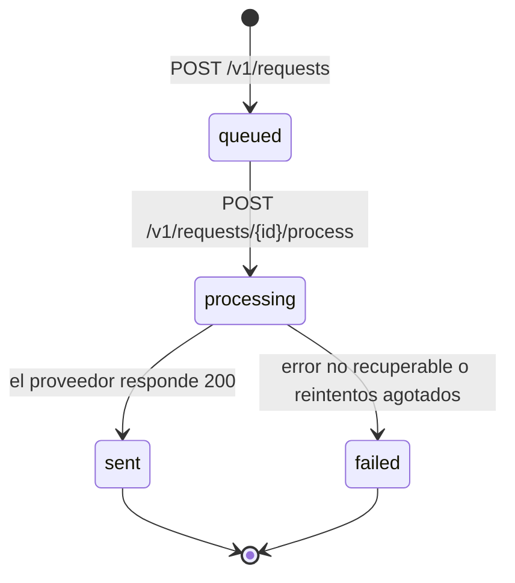

# AMS Solutions - Prueba técnica backend Python

Servicio de notificaciones que hace de mediador entre los clientes y un proveedor externo. El enunciado está en [docs/prueba-tecnica.md](docs/prueba-tecnica.md).

## Versiones

- La solución para la prueba técnica ha sido desarrollada en la carpeta `app` con la versión 3.12 de Python.

## Cómo ejecutarlo

Es necesario tener instalado Docker.

Levantar el proveedor y la infraestructura de evaluación:

```bash
docker-compose up -d provider influxdb grafana
```

Levantar la aplicación:

```bash
docker-compose up -d --build app
```

Ejecutar el test de carga:

```bash
docker-compose run --rm load-test
```

Los resultados se ven en [Grafana](http://localhost:3000/d/backend-performance-scorecard/).

**NOTA:** Para agilizar el desarrollo y no tener que hacer rebuild de la aplicación constantemente he usado un entorno virtual de Python para tener levantado el servicio de uvicorn constantemente y aprovechar el hot reloading. El resto de servicios se manejan de la misma forma con Docker, pero el app lo lanzo en modo desarrollo así:

```bash
cd app
py -3.12 -m venv .venv
source .venv/Scripts/activate
pip install -r requirements.txt # o requirements-dev.txt para modo desarrollo
uvicorn main:app --reload --port 5001
```

El puerto 5001 evita chocar con el 5000, que publica el contenedor del proveedor para la aplicación dockerizada y que es el que usa el test de carga.

### Tests

Desde `app/`, con el entorno virtual podemos lanzar los tests con el comando `pytest` (siempre y cuando tengamos instalada la dependencia).

Los tests viven en `app/tests/`, junto al código que prueban, para que la solución quede entera dentro de `app/`. `app/.dockerignore` excluye de la imagen de Docker `tests/`, `pytest.ini`, `requirements-dev.txt` y el entorno virtual `.venv/`.

- `tests/conftest.py` es común a todas las subcarpetas.
- `tests/unit/` prueba cada pieza aislada. No necesita el proveedor levantado: sus respuestas se simulan con `httpx.MockTransport`.
- `tests/integration/` prueba los endpoints de punta a punta dentro de la app: llama a la app en memoria con `httpx.ASGITransport`, sin levantar un servidor, y sustituye la dependencia del servicio con `app.dependency_overrides` para que cada test parta de un repositorio vacío.

Cada carpeta de tests lleva un `__init__.py` vacío para que pytest las importe como paquetes y se puedan repetir nombres de fichero entre `unit/` y otras subcarpetas.

### Integración continua

`.github/workflows/ci.yml` se ejecuta en cada pull request y en cada push a `main`. Lanza `pytest` con Python 3.12 y comprueba que la imagen de `app/` se construye. El test de carga con k6 no forma parte de la pipeline: necesita el proveedor, InfluxDB y Grafana levantados, y en los runners de GitHub los tiempos varían demasiado para que el resultado sea fiable. Se ejecuta en local con `docker-compose run --rm load-test`.

## Decisiones de diseño

### Estructura de carpetas

```text
app/
  main.py               # crea la app FastAPI y monta los routers bajo /v1
  config.py             # configuración leída del entorno
  notifications/
    router.py           # endpoints de /v1/requests; solo traduce HTTP
    schemas.py          # cuerpos de entrada y de respuesta de la API
    models.py           # la solicitud guardada y sus estados
    service.py          # reglas de negocio: crear, procesar y consultar
    repository.py       # almacén de solicitudes
    dependencies.py     # instancias compartidas que FastAPI inyecta en el router
    provider.py         # cliente del proveedor externo
  tests/                # tests con pytest, excluidos de la imagen
    conftest.py
    unit/
    integration/
```

El código se agrupa por dominio y no por capas. Todo lo que tiene que ver con las notificaciones vive junto, y un dominio nuevo sería otra carpeta al mismo nivel.

`schemas.py` y `models.py` están separados a propósito: los esquemas son el contrato HTTP, validado por Pydantic, y los modelos son lo que la app guarda. Así el estado interno de una solicitud puede cambiar sin tocar el contrato. Los esquemas de entrada acaban en `Request` y los de salida en `Response`, con un prefijo que dice qué contienen: `NotificationCreatedResponse` o `NotificationStatusResponse`.

### Ciclo de vida de una solicitud

El contrato separa registrar una notificación (`POST /v1/requests`) de enviarla (`POST /v1/requests/{id}/process`), y el envío depende de un proveedor lento que falla al azar, tarda entre 0,1 y 0,5 segundos, devuelve un 500 en el 10 % de las llamadas y un 429 por encima de 50 peticiones cada 10 segundos. El cliente no puede esperar en la misma petición a que la notificación salga, así que consulta cómo va con `GET /v1/requests/{id}`.

Por eso cada solicitud es una pequeña máquina de estados en lugar de un simple registro. Así el cliente sabe en todo momento si su notificación está pendiente, en curso, enviada o perdida, aunque el proveedor falle. Las transiciones solo avanzan, de modo que una solicitud enviada no vuelve a procesarse, algo importante porque el proveedor no ofrece idempotencia y procesarla dos veces mandaría dos notificaciones. Y un error del proveedor que no se recupera deja la solicitud en `failed`, en lugar de perderse o devolver un 500 al cliente.



Los valores los fija el enunciado; la semántica y las transiciones son decisión de diseño. El registro ya crea las solicitudes en `queued`; el resto de transiciones llegan con el procesamiento.

### Almacén de solicitudes

Las solicitudes se guardan en un diccionario en memoria, detrás de `repository.py`. Basta porque el Dockerfile arranca un solo proceso de uvicorn: con varios workers, cada uno tendría su propio diccionario y un `GET` podría no encontrar una solicitud creada en otro. Para escalar a varios procesos habría que sustituir `repository.py` por un almacén compartido, como Redis, sin tocar el servicio ni el router.

El almacén tampoco sobrevive a un reinicio: al parar la app, o al recargar uvicorn en desarrollo, se pierden todas las solicitudes. Es un compromiso asumido para la prueba, en la que cada ejecución de k6 crea sus propias solicitudes y no necesita las anteriores. Un almacén persistente lo resolvería con el mismo cambio de `repository.py`.

### Errores del dominio y códigos HTTP

Se usa un manejador global en lugar de un `try`/`except` en cada endpoint porque varios endpoints buscan por `id`: el `GET` ya lo hace y `process` lo hará. Así cada endpoint se queda en llamar al servicio y devolver el resultado, y los errores que vengan después, como intentar procesar una solicitud ya enviada, seguirán el mismo camino.

### Configuración

`config.py` lee del entorno la URL y la API key del proveedor. Para la prueba técnica se asumen usar los valores configurados como valores por defecto, pero en un entorno real se consideraría información sensible y habría que protegerlas con variables de entorno o almacenes seguros.

| Variable            | Valor por defecto       |
| ------------------- | ----------------------- |
| `PROVIDER_BASE_URL` | `http://localhost:3001` |
| `PROVIDER_API_KEY`  | `test-dev-2026`         |

### Cliente del proveedor

`notifications/provider.py` es un adaptador sobre `POST /v1/notify`.

- Usa un único `httpx.AsyncClient` por instancia para reutilizar conexiones bajo carga.
- Devuelve el `provider_id` cuando la respuesta es 200.
- Cualquier otro resultado lanza `ProviderError`: los 401, 429 y 500 con su código HTTP, y los errores de red o el timeout de 5 segundos con `status_code=None`.
- No reintenta ni decide el estado final de la solicitud. Esa responsabilidad queda fuera del adaptador, en la capa que orquesta el procesamiento.
